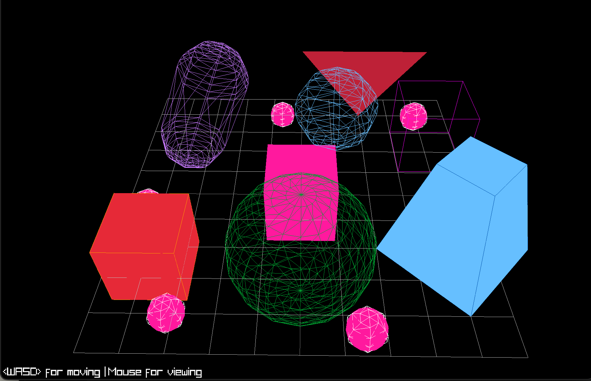

## Overview
- small additional project after learning the basics in raylib & circle animation
- I used some of the example shapes and created a 3D Grid + free camera movement
 Features

## Controls
 
| Key / Input | Action |
|-------------|--------|
| `W A S D` | Move camera |
| Mouse | Look around |
| `Q` / `E` | Move up / down |
| `ESC` | Quit |
 
---
 
### Install & run
 
```bash
brew install raylib
gcc main.c -o shapes -lraylib -lm
```
```bash
git clone https://github.com/raysan5/raylib.git
cd raylib/src
make PLATFORM=PLATFORM_DESKTOP
sudo make install
```
```bash
 clang code.c -I/opt/homebrew/include -L/opt/homebrew/lib -lraylib -lm -g -o shapes 
# Run it
./shapes
```
 
---
 

> Screenshot from the application
## Resources
 
- [Raylib Cheatsheet](https://www.raylib.com/cheatsheet/cheatsheet.html)
- [Raylib GitHub](https://github.com/raysan5/raylib)
- [DrawLine Function](https://raylibhelp.wuaze.com/reference/pages/DrawGrid/DrawGrid.htm?i=1#examples)
